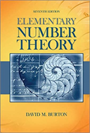

## Math 341
Spring 2023
MWF 2:00-2:50 pm HHH 318

## Instructor

Mckenzie West
Preferred Names: Prof. West, Dr. West, Mckenzie 
Pronouns: She/Her/Hers
Office: HHH 524
Drop-in Hours: Wed 11-12 pm, or whenever my door is open.
Additional drop-in hours will be decided as a group and may entirely change.

E-mail: [westmr@uwec.edu](mailto:westmr@uwec.edu)
Official Textbook: Elementary Number Theory, Seventh Edition, by David M. Burton
Second Textbook:  [Number Theory: In Context and Interactive](https://math.gordon.edu/ntic/ntic/frontmatter-1.html), Karl-Dieter Crisman

We're going to be using this online textbook as our main source of content. There are many advantages to using an Online Education Resource: we don’t feel financially limited to the content of the single textbook, there is direct software integration with SageMath, and we can all easily access the textbook where and when we need. 

That being said, I will generally provide readings from both sources for you to choose which you prefer.

## Course Description
Classical number theory including divisibility, primes and their properties, theory of congruences, Diophantine equations, number theoretic functions, primitive roots, and selected optional topics.

## Course Goals 
After the completion of Math 341, students will be able to
1.	recognize and answer number theoretic questions,
2.	understand and describe the words in the course description: divisibility, primes, congruences, Diophantine equations, number theoretic functions, and primitive roots,
3.	prove or disprove statements using a given list of definitions and theorems, and
4.	communicate mathematics through written and verbal means. 

## Equity and Inclusion
A major component of this course is large group discussion. I ask that you recognize that all of your classmates have different mathematical backgrounds and experiences. Respect one another; give everyone a space to answer a question, to ask a question, to have an idea, and to be wrong.

## Important Dates
*	Last Day to Drop: February 14
*	Last Day to Withdraw (W on transcript):  April 28

## Evauation
### Summary
This course is going to be graded using a standard point-based grading scheme.

### Grading Scheme
*	40% - Written Assignments
* 15% - Computational Assignments (WeBWorK)
*	15% - Midterm Exam 
*	15% - Final Exam
* 15% - Project

#### Written Assignments
The written homework will be due weekly at 4pm on Wednesdays. These problems will be graded for accuracy and are expected to be complete, well-organized, and clearly written. You can either submit the assignments on Canvas or in person. If you hand-write your solutions I strongly prefer you submit in person.

In some cases re-writes will be allowed. This depends on the assignment and the opportunity for growth.

#### Computational Assignments 
WeBWorK assignments will be due weekly on Mondays.  For most WeBWorK problems you will have unlimited attempts. Think of these as low-stakes practice.

#### Midterm and Final Exam
There will be one midterm exam and one final exam. Exams are closed internet and to be completed individually. The proposed due dates for the take-home midterm exam is March 8.

#### Project 
Starting after Spring Break, you will begin working on a project, more details about the content and due dates will be provided at that point in the course.

## Attendance Policy
You are expected to attend class every day. Consistent with university policy, attendance will be taken each class period to ensure you keep your insurance and financial aid.

## Technology
Students are encouraged not to engage in disruptive use of technology. The use of calculators or mathematical software will be allowed for most homework exercises. You are absolutely not to use resources such as Chegg and StackExchange for homework help or answers. DO NOT GOOGLE THE ANSWERS!

## Health and Safety
This class will adhere to UWEC COVID-19 policies and guidelines as found here [HTTPS://WWW.UWEC.EDU/CORONAVIRUS-UPDATES/](HTTPS://WWW.UWEC.EDU/CORONAVIRUS-UPDATES/). Each of us shares responsibility for the health and safety of all in the classroom environment.

If you are sick, please stay home and get notes from your classmates. Do not expect that the days lecture will be recorded.

## Collaboration
You are expected to work together on homework sets, though everyone is required to write up and submit their own solutions, unless otherwise stated. Solutions that appear to be direct copies of a classmate’s or of ones found online will require a one-on-one meeting with me to discuss the source and next steps.

## Make-up Policies
You are expected to get your homework to Canvas by the deadline each week. If for some reason, you cannot meet that deadline, please get in touch with me, so that we can discuss proper arrangements.
Due to the nature of specifications grading, you will be expected to turn in repeated attempts at assignments on subsequent Wednesdays.

## Resources
* **Drop-in Hours:** These are designated times where I will be available in my office. Stop by with questions or concerns about the class. Every question is welcome. We all have questions and need clarifications sometimes. 
* **SERVICES FOR STUDENTS WITH DISABILITIES** - Any student who has a disability and is in need of classroom accommodations should contact the instructor and the Services for Students with Disabilities Office in Centennial Hall 2106 at the beginning of the semester. [HTTPS://WWW.UWEC.EDU/EQUITY-DIVERSITY-INCLUSION/EDI-SERVICES-PROGRAMS/SERVICES-FOR-STUDENTS-WITH-DISABILITIES/](HTTPS://WWW.UWEC.EDU/EQUITY-DIVERSITY-INCLUSION/EDI-SERVICES-PROGRAMS/SERVICES-FOR-STUDENTS-WITH-DISABILITIES/)
*	**UWEC COUNSELING SERVICES** – A place on campus where you can find someone to talk to when you're feeling hopeless, lonely, depressed, confused, upset over a relationship, or just plain stressed. Call for an appointment: (715) 836-5521.

## Accessibility
If you are in need of accommodations, please speak with me before/after class or in my office as soon as possible so that we can make arrangements that suit your needs.

## Mandated Reporting
As a Wisconsin State employee, I am obligated to report any claims of sexual harassment or sexual assault. Please know that any such information revealed to me will be forwarded to the Dean of Students. The Dean of Students office may reach out to you to offer resources and support. If you wish to disclose this information to a confidential resource, you may speak to someone in the Center for Awareness of Sexual Assault, Counseling Services, or Student Health Services.

## Academic Conduct
I ask that you only submit your own work in order to ensure that you are indeed the one learning the material and meeting the objectives. The disciplinary procedures and penalties for academic misconduct are described on the UW-Eau Claire Dean of Students web site: [HTTPS://WWW.UWEC.EDU/KB/ARTICLE/BLUGOLD-STUDENT-CONDUCT-CODE/](HTTPS://WWW.UWEC.EDU/KB/ARTICLE/BLUGOLD-STUDENT-CONDUCT-CODE/).

## Course Notes
**Do Not Post Class Notes Online** – *This includes posting homework assignments to sites like Chegg.* 
I do not consent to having notes from my class uploaded to the internet, including commercial note-selling websites such as StudySoup. Some companies target students and solicit course material acting as if they are working in coordination with colleges and universities, but that is not true for this class. This means that you do not have the right to provide your notes to anyone else or to make any commercial use of them without express prior permission from me. Unless you are a qualified disabled student, you do not have the right to record my lectures. Inappropriate use of notes may be in violation of the Blugold Conduct Code and sanctions will be pursued accordingly.
